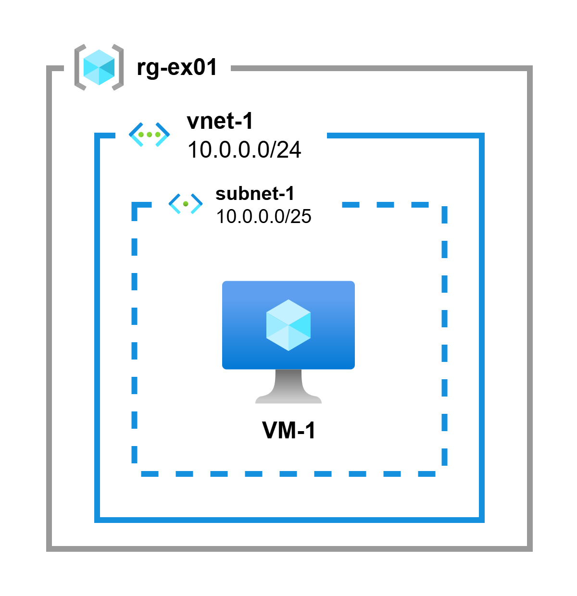

# Exercise 1 - Single VNet with Virtual Machine

## Learn

### Virtual Network Overview
An Azure Virtual Network (VNet) is a representation of your own network in the cloud. It is a logical isolation of the Azure cloud dedicated to your subscription. VNets enable you to securely connect Azure resources to each other, to the internet, and to on-premises networks. Virtual Networks are fundamental building blocks for your private network in Azure.

### Subnet Architecture
Subnets enable you to segment the virtual network into one or more sub-networks and allocate a portion of the virtual network's address space to each subnet. You can then deploy Azure resources in a specific subnet. Just like in a traditional network, subnets allow you to segment your VNet address space into segments that are appropriate for the organization's internal network.

## Exercise Specifications

**Architecture Overview:**

<p align="center">
    
</p>

Deploy an Ubuntu 24.04 LTS virtual machine (VM) in Azure using Terraform. The VM should be placed in a virtual network with proper subnet configuration.

- **Virtual Network**
    - **Name:** `vnet-1`
    - **Address Space:** `10.0.0.0/24`
- **Subnet**
    - **Name:** `subnet-1`
    - **Address Prefix:** `10.0.0.0/25`
- **Virtual Machine**
    - **Name:** `VM-1`
    - **Size:** `Standard_B2s` (2 vCPUs, 4 GB RAM)
    - **Operating System:** Ubuntu 24.04 LTS
    - **Network:** Connected to `subnet-1`

You will need to create the following files: `main.tf`, `variables.tf`, and `providers.tf`.
## Quickstart

The Azure CLI and Terraform are pre-installed in this dev container.

1. **Login to Azure**
    ```bash
    az login
    ```

2. **Set Your Variables**  
    Create a `dev.tfvars` file in the `Ex1/` folder with the required variables (see example below):

    ```hcl
    subscription_id       = "xxxxxx"
    resource_group_name   = "rg-ex01"
    location              = "francecentral"
    virtual_network_name  = "vnet-1"
    subnet_name           = "subnet-1"
    vm_name               = "VM-1"
    vm_size               = "Standard_B2s" # 2 vCPUs, 4 GB RAM
    vm_username           = "MyAdminUser"
    vm_password           = "MyP@ssw0rd!"
    ```

3. **Deploy with Terraform**
    Run the following commands from the `Ex1/` directory:
    ```bash
    # Initialize Terraform
    terraform init

    # Validate the configuration files
    terraform validate

    # Prepare the deployment plan
    terraform plan -var-file="dev.tfvars"

    # Apply the configuration to create resources
    terraform apply -var-file="dev.tfvars"
    ```

## Cleanup

To remove all resources created by this exercise, run:

```bash
terraform destroy -var-file="dev.tfvars"
```

