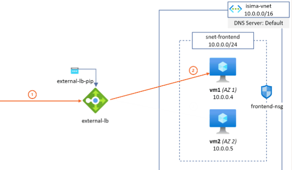

# Exercise 2 - Load Balancer with Virtual Machines

## Learn

### Load Balancer Overview
An Azure Load Balancer is a Layer 4 (Transport Layer) load balancer that distributes incoming network traffic across multiple backend resources, such as virtual machines (VMs), to ensure high availability and reliability of applications. It operates at the TCP and UDP protocols and can handle millions of requests per second with low latency.

### Hash-Tuple Based Distribution
Azure Load Balancer uses a hash-based distribution algorithm to distribute incoming network traffic across multiple backend resources. The hash is computed based on a combination of fields from the incoming packet, typically including:

- Source IP address
- Source port
- Destination IP address
- Destination port
- Protocol type

This combination of fields is referred to as a "5-tuple" (or "2-tuple" in some cases).

## Exercise Specifications

**Architecture Overview:**

<p align="center">
    
</p>

Deploy two virtual machines in Azure using Terraform, and place them behind an Azure Load Balancer.


- **Virtual Network**
    - **Name:** `vnet-1`
    - **Address Space:** `10.0.0.0/16`
- **Subnet**
    - **Name:** `subnet-1`
    - **Address Prefix:** `10.0.0.0/24`
- **Virtual Machines**
    - **VM-1**
        - **Size:** `Standard_B2s` (2 vCPUs, 4 GB RAM)
        - **Private IP:** `10.0.0.4`
    - **VM-2**
        - **Size:** `Standard_B2s` (2 vCPUs, 4 GB RAM)
        - **Private IP:** `10.0.0.5`
- **Load Balancer**
    - **Name:** `lb-1`
    - **Frontend IP:** Public IP assigned by Azure
    - **Backend Pool:** Includes `VM-1` and `VM-2`
    - **Health Probe:** TCP probe on port `80`
    - **Load Balancing Rule:** Distributes HTTP traffic (port `80`) to backend VMs

Each VM should host a simple HTML page displaying its private IP address. This page must be accessible via HTTP through the Load Balancer.

You will need to create the following files: `main.tf`, `variables.tf`, and `providers.tf`.

## Quickstart

The Azure CLI and Terraform are pre-installed in this dev container.

1. **Login to Azure**
    ```bash
    az login
    ```

2. **Set Your Variables**  
    Create a `dev.tfvars` file in the `Ex2/` folder with the required variables (see example below):

    ```hcl
    subscription_id       = "xxxxxx"
    resource_group_name   = "rg-ex02"
    location              = "francecentral"
    virtual_network_name  = "vnet-1"
    subnet_name           = "subnet-1"
    vm_name               = "VM-1"
    vm_size               = "Standard_B2s" # 2 vCPUs, 4 GB RAM
    vm_username           = "MyAdminUser"
    vm_password           = "MyP@ssw0rd!"
    ```

3. **Deploy with Terraform**
    Run the following commands from the `Ex2/` directory:
    ```bash
    # Initialize Terraform
    terraform init

    # Validate the configuration files
    terraform validate

    # Prepare the deployment plan
    terraform plan -var-file="dev.tfvars"

    # Apply the configuration to create resources
    terraform apply -var-file="dev.tfvars"
    ```

## Cleanup

To remove all resources created by this exercise, run:

```bash
terraform destroy -var-file="dev.tfvars"
```
