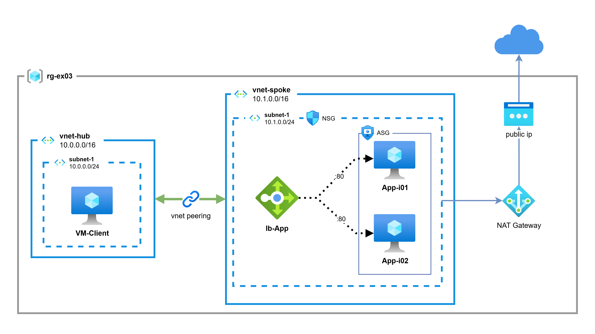

# Exercise 3 - Hub-Spoke Architecture with Internal Load Balancer

## Learn

### Hub-Spoke Network Topology
The Hub-Spoke network topology is a widely used architecture pattern in Azure that provides centralized connectivity and management. In this model:

- **Hub VNet**: Acts as the central point of connectivity, typically hosting shared services like VPN gateways, firewalls, or management VMs
- **Spoke VNet(s)**: Connect to the hub via VNet peering, hosting specific workloads or applications
- **VNet Peering**: Enables low-latency, high-bandwidth connectivity between VNets

This architecture provides:
- **Centralized management** and security
- **Resource isolation** between different workloads
- **Cost optimization** by sharing common services
- **Scalability** by adding more spoke VNets

### Internal Load Balancer
An Azure Internal Load Balancer distributes traffic within a virtual network, without exposing resources to the internet. It's ideal for:
- Multi-tier applications
- Line-of-business applications
- Backend services that don't require direct internet access

### NAT Gateway
Azure NAT Gateway provides outbound internet connectivity for resources in a virtual network. It offers:
- **Static public IP** for outbound traffic
- **High availability** without configuration overhead
- **Scalability** to support high-bandwidth demands

### Application Security Groups (ASG)
ASGs enable you to group virtual machines logically and define network security rules based on those groups, simplifying security management at scale.

## Exercise Specifications

**Architecture Overview:**

<p align="center">
    
</p>

Deploy a Hub-Spoke network architecture with an internal Load Balancer in the Spoke VNet.

### Hub VNet Configuration
- **Name:** `vnet-hub`
- **Address Space:** `10.0.0.0/16`
- **Subnet:** `subnet-hub-01` (`10.0.0.0/24`)
- **Resources:**
  - **VM-Client**: Ubuntu 24.04 LTS VM for testing connectivity

### Spoke VNet Configuration
- **Name:** `vnet-spoke`
- **Address Space:** `10.1.0.0/16`
- **Subnet:** `subnet-spoke-01` (`10.1.0.0/24`)
- **Resources:**
  - **VM-APP-I01**: Ubuntu 24.04 LTS with Nginx (displays "VM1")
  - **VM-APP-I02**: Ubuntu 24.04 LTS with Nginx (displays "VM2")
  - **Internal Load Balancer**: Distributes traffic to both VMs
  - **NAT Gateway**: Provides outbound internet connectivity
  - **Application Security Group**: Groups the application VMs
  - **Network Security Group**: Controls traffic flow

### Network Security
- **NSG Rules:**
  - Allow outbound traffic to Internet for package updates
- **NAT Gateway** provides secure outbound connectivity with a static public IP

### VNet Peering
- Bidirectional peering between Hub and Spoke VNets
- Allows VM-Client in Hub to access the internal Load Balancer in Spoke

## Quickstart

The Azure CLI and Terraform are pre-installed in this dev container.

### 1. Login to Azure
```bash
az login
```

### 2. Set Your Variables
Create a `terraform.tfvars` file in the `Ex3/` folder:

```hcl
subscription_id  = "your-subscription-id"
location         = "francecentral"
admin_username   = "azureuser"
admin_password   = "YourSecurePassword123!"
```

> **Note**: Never commit the `terraform.tfvars` file to version control as it contains sensitive information.

### 3. Initialize Terraform
```bash
cd Ex3/
terraform init
```

### 4. Preview the Changes
```bash
terraform plan
```

### 5. Deploy the Infrastructure
```bash
terraform apply
```

### 6. Test the Configuration

After deployment, note the outputs:

```bash
terraform output
```

**Test from vm-client:**

1. Connect to vm-client (use Azure Portal Serial Console or Bastion)
2. Test the internal Load Balancer:
   ```bash
   curl http://<lb_internal_private_ip>
   ```
3. Refresh multiple times to see load balancing between VM1 and VM2

**Test outbound connectivity:**

1. SSH to vm-app-i01 or vm-app-i02
2. Test internet access via NAT Gateway:
   ```bash
   curl ifconfig.me
   ```
   This should return the NAT Gateway's public IP

### 7. Clean Up Resources
```bash
terraform destroy
```

## Architecture Components

| Resource Type | Name | Purpose |
|--------------|------|---------|
| Resource Group | `rg-ex03` | Container for all resources |
| VNet (Hub) | `vnet-hub` | Hub network (10.0.0.0/16) |
| VNet (Spoke) | `vnet-spoke` | Spoke network (10.1.0.0/16) |
| VNet Peering | `hub-to-spoke` / `spoke-to-hub` | Bidirectional connectivity |
| VM (Hub) | `vm-client` | Client for testing |
| VMs (Spoke) | `vm-app-i01`, `vm-app-i02` | Web servers with Nginx |
| Load Balancer | `lb-spoke` | Internal LB in Spoke VNet |
| NAT Gateway | `nat-gateway-01` | Outbound internet connectivity |
| Public IP | `pip-spoke-01` | NAT Gateway public IP |
| ASG | `asg-spoke-01` | Application security group |
| NSG | `nsg-spoke-01` | Network security group |

## Key Learning Points

1. **Hub-Spoke Topology**: Centralized network architecture for scalability
2. **VNet Peering**: Seamless connectivity between VNets
3. **Internal Load Balancing**: Private traffic distribution
4. **NAT Gateway**: Secure outbound connectivity with static IP
5. **Application Security Groups**: Logical grouping for security
6. **Network Security**: NSG rules for controlling traffic

## Troubleshooting

### Cannot reach Load Balancer from vm-client
- Verify VNet peering is established: `az network vnet peering show`
- Check NSG rules allow traffic between subnets
- Ensure VMs are healthy in the backend pool

### VMs cannot access the internet
- Verify NAT Gateway is associated with the subnet
- Check NAT Gateway has a public IP attached
- Verify NSG allows outbound traffic

### Load Balancer not distributing traffic
- Check health probe status in Azure Portal
- Verify Nginx is running on both VMs: `systemctl status nginx`
- Ensure backend pool contains both VMs

## Next Steps

Try **Exercise 4** to learn about:
- External Load Balancer in addition to Internal Load Balancer
- Exposing applications to the internet securely
- Managing dual Load Balancer scenarios
