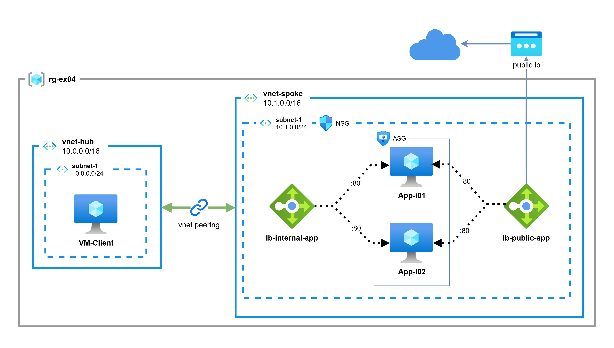

# Exercise 4 - Hub-Spoke with Dual Load Balancers (Internal + External)

## Learn

### Dual Load Balancer Architecture
In production environments, it's common to have both internal and external load balancers:

- **External Load Balancer**: Exposes applications to the internet with a public IP address, serving as the entry point for external users
- **Internal Load Balancer**: Distributes traffic within the private network, enabling communication between different application tiers or from on-premises networks

This dual setup enables:
- **Internet-facing applications** while maintaining security
- **Multi-tier architectures** with frontend and backend separation
- **Hybrid connectivity** for on-premises or VPN-connected clients
- **Traffic segregation** between public and private access patterns

### Use Cases
1. **Web Applications**: External LB for internet users, Internal LB for backend database access
2. **Hybrid Scenarios**: External LB for cloud users, Internal LB for on-premises users via VPN
3. **Microservices**: External LB for API gateway, Internal LB for inter-service communication

### Multiple Backend Pools
A single VM can be part of multiple backend pools, allowing it to serve both external and internal traffic. Azure Load Balancer handles this efficiently, routing traffic based on the frontend IP configuration.

## Exercise Specifications

**Architecture Overview:**

<p align="center">
    
</p>

Deploy a Hub-Spoke architecture with **both internal and external Load Balancers** in the Spoke VNet, demonstrating how to expose the same backend VMs to both internet and private network traffic.

> 💡 **Need help?** The complete solution is available in [`solution/`](./solution/)

### Hub VNet Configuration
- **Name:** `vnet-hub`
- **Address Space:** `10.0.0.0/16`
- **Subnet:** `subnet-hub-01` (`10.0.0.0/24`)
- **Resources:**
  - **VM-Client**: Ubuntu 24.04 LTS VM for testing private connectivity

### Spoke VNet Configuration
- **Name:** `vnet-spoke`
- **Address Space:** `10.1.0.0/16`
- **Subnet:** `subnet-spoke-01` (`10.1.0.0/24`)
- **Resources:**
  - **VM-APP-I01**: Ubuntu 24.04 LTS with Nginx (displays "VM1")
  - **VM-APP-I02**: Ubuntu 24.04 LTS with Nginx (displays "VM2")
  - **Internal Load Balancer**: For private traffic from Hub VNet
  - **External Load Balancer**: For public internet traffic
  - **Application Security Group**: Groups the application VMs
  - **Network Security Group**: Controls inbound/outbound traffic

### Load Balancers Configuration
Both VMs are members of both backend pools:

**Internal Load Balancer (`lb-internal-spoke`)**
- Frontend: Private IP in `subnet-spoke-01`
- Backend Pool: Both VM-APP-I01 and VM-APP-I02
- Health Probe: HTTP on port 80
- Load Balancing Rule: Port 80 TCP

**External Load Balancer (`lb-external-spoke`)**
- Frontend: Public IP address
- Backend Pool: Both VM-APP-I01 and VM-APP-I02
- Health Probe: HTTP on port 80
- Load Balancing Rule: Port 80 TCP

### Network Security
- **NSG Rules (Inbound):**
  - `allow-http` (priority 110): Allow HTTP from Internet to ASG
  - `allow-http-from-hub` (priority 115): Allow HTTP from Hub VNet (10.0.0.0/16) to ASG
  - `D-IN-Any` (priority 4096): Deny all other inbound traffic
- **NSG Rules (Outbound):**
  - `allow-internet` (priority 110): Allow ASG to Internet
  - `D-OU-Any` (priority 4096): Deny all other outbound traffic
- **Outbound Connectivity**: VMs use External Load Balancer's public IP for SNAT

### VNet Peering
- Bidirectional peering between Hub and Spoke VNets
- Enables VM-Client in Hub to access the internal Load Balancer
- External Load Balancer accessible from internet

## Quickstart

The Azure CLI and Terraform are pre-installed in this dev container.

### 1. Login to Azure
```bash
az login
```

### 2. Set Your Variables
Create a `terraform.tfvars` file in the `Ex4/` folder:

```hcl
subscription_id  = "your-subscription-id"
location         = "francecentral"
admin_username   = "azureuser"
admin_password   = "YourSecurePassword123!"
```

> **Security Note**: Never commit the `terraform.tfvars` file to version control. It's already listed in `.gitignore`.

### 3. Initialize Terraform
```bash
cd Ex4/
terraform init
```

### 4. Preview the Changes
```bash
terraform plan
```

### 5. Deploy the Infrastructure
```bash
terraform apply
```

Deployment takes approximately 5-7 minutes.

### 6. Test the Configuration

After deployment, retrieve the outputs:

```bash
terraform output
```

#### Test External Load Balancer (from your local machine)

```bash
# Get the public IP
LB_PUBLIC_IP=$(terraform output -raw lb_external_public_ip)

# Test the external Load Balancer
curl http://$LB_PUBLIC_IP

# Refresh multiple times to see load balancing
for i in {1..10}; do curl http://$LB_PUBLIC_IP; done
```

You should see alternating responses of "VM1" and "VM2".

#### Test Internal Load Balancer (from vm-client)

1. Connect to vm-client via Azure Portal (Serial Console or Bastion)
2. Test the internal Load Balancer:
   ```bash
   LB_INTERNAL_IP="<lb_internal_private_ip>"
   curl http://$LB_INTERNAL_IP
   
   # Test load balancing
   for i in {1..10}; do curl http://$LB_INTERNAL_IP; done
   ```

### 7. Clean Up Resources
```bash
terraform destroy
```

## Architecture Components

| Resource Type | Name | Purpose |
|--------------|------|---------|
| Resource Group | `rg-ex04` | Container for all resources |
| VNet (Hub) | `vnet-hub` | Hub network (10.0.0.0/16) |
| VNet (Spoke) | `vnet-spoke` | Spoke network (10.1.0.0/16) |
| VNet Peering | `hub-to-spoke` / `spoke-to-hub` | Bidirectional connectivity |
| VM (Hub) | `vm-client` | Client for internal testing |
| VMs (Spoke) | `vm-app-i01`, `vm-app-i02` | Web servers with Nginx |
| Load Balancer (Internal) | `lb-internal-spoke` | Private traffic distribution |
| Load Balancer (External) | `lb-external-spoke` | Public traffic distribution |
| Public IP (LB) | `pip-external-lb` | External LB public IP |
| ASG | `asg-spoke-01` | Application security group |
| NSG | `nsg-spoke-01` | Network security group |

## Key Learning Points

1. **Dual Load Balancer Pattern**: Same VMs serving both public and private traffic
2. **Multiple Backend Pools**: Single VM can be in multiple backend pools
3. **Internet Exposure**: Securely exposing applications with External LB
4. **Hub-Spoke Isolation**: Separate VNets for different workload tiers
5. **Application Security Groups (ASG)**: Logical grouping for NSG rules targeting VMs
6. **Security Layers**: NSG + ASG + Deny-all rules for defense in depth

## Traffic Flow Scenarios

### Scenario 1: Internet User Access
1. User → External LB Public IP (port 80)
2. External LB → VM-APP-I01 or VM-APP-I02
3. Response → External LB → User

### Scenario 2: Internal Client Access
1. VM-Client → Internal LB Private IP (port 80)
2. Internal LB → VM-APP-I01 or VM-APP-I02
3. Response → Internal LB → VM-Client

### Scenario 3: Backend VMs Outbound
1. VM-APP-I01/I02 → External Load Balancer (SNAT)
2. LB Public IP (`pip-external-lb`) → Internet

## Troubleshooting

### Cannot access External Load Balancer from internet
- Check NSG allows inbound HTTP (port 80) from Internet
- Verify External LB has a public IP assigned
- Ensure backend VMs are healthy in health probe
- Check Nginx is running: `systemctl status nginx`

### Cannot reach Internal Load Balancer from vm-client
- Verify VNet peering status: `az network vnet peering list`
- Check there are no NSG rules blocking inter-VNet traffic
- Verify Internal LB private IP is reachable

### Load balancing not working
- Check backend pool health in Azure Portal
- Verify health probes are passing
- Ensure both VMs have Nginx running
- Check for conflicting NSG rules (priority 110 for allow-http, 115 for allow-http-from-hub)

### VMs cannot reach internet for updates
- Verify VMs are in the External Load Balancer's backend pool
- Verify NSG `allow-internet` rule allows outbound traffic from ASG
- Check VMs are associated with `asg-spoke-01`

## Security Considerations

1. **Public Exposure**: Only Load Balancer has public IP, not individual VMs
2. **Deny-by-Default**: Explicit deny-all rules (D-IN-Any, D-OU-Any) at priority 4096
3. **NSG Rules**: Granular control with ASG-based targeting
4. **ASG**: Logical grouping simplifies security management
5. **Hub Access**: Specific rule for HTTP from Hub VNet (10.0.0.0/16)
6. **Credentials**: Use variables and secure storage (never hardcode)

## Comparison with Exercise 3

| Feature | Exercise 3 | Exercise 4 |
|---------|-----------|------------|
| Internet Access | No | Yes (External LB) |
| Internal Access | Yes | Yes |
| Public IPs | NAT Gateway | External LB only |
| Use Case | Private applications | Public-facing apps |
| NSG Complexity | Lower | Higher (HTTP inbound + deny-all rules) |
| Outbound Method | NAT Gateway | External LB SNAT |

## Next Steps

**Enhancements to try:**
- Add Azure Bastion for secure VM access
- Implement Azure Firewall in Hub VNet
- Add HTTPS with SSL/TLS certificates
- Implement Azure Application Gateway for Layer 7 features
- Add Azure DDoS Protection for external Load Balancer
- Deploy multiple spoke VNets with different workloads